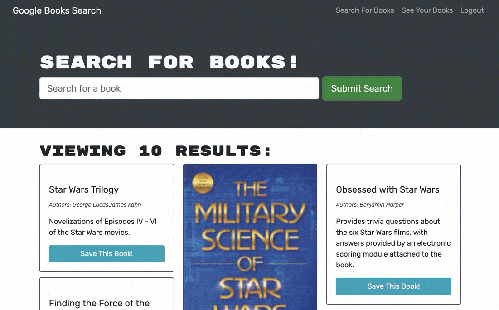
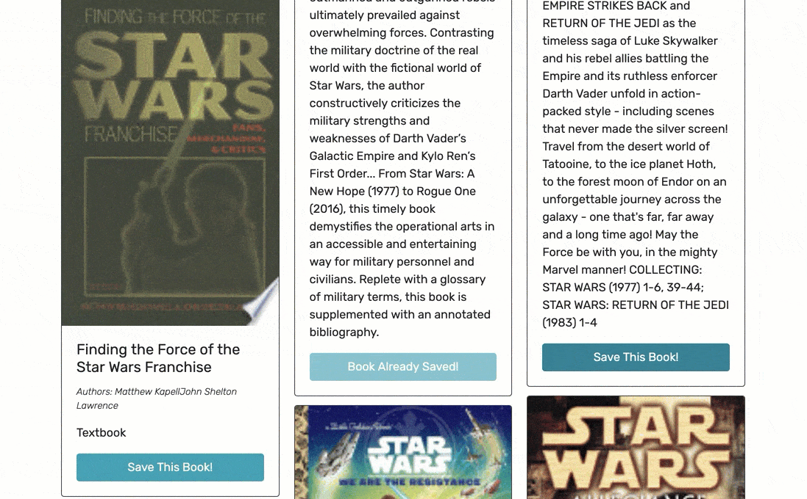
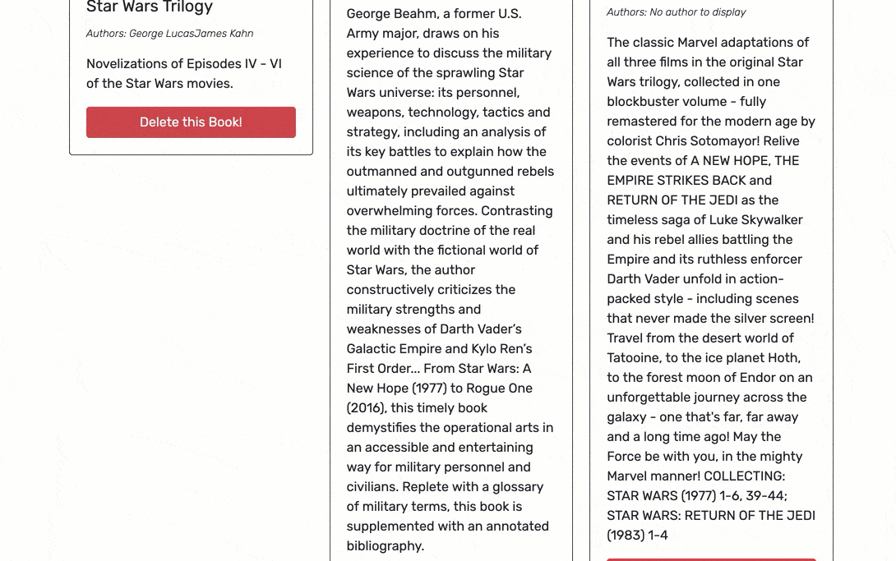

## :book:Mern Book Search Engine

- [Link to live application]()

## Table of Contents

- [Description](#description)
- [User Story](#user-story)
- [Acceptance Criteria](#acceptance-criteria)
- [Installation](#installation)
- [Local Usage](#Local-Usage)
- [Technologies Used](#technologies-used)
- [Features](#features)
- [Application Screenshot Preview](#application-screenshot-preview)
- [Resources & Credit](#resourcescredit)
- [License](#License)

## Description

This MERN stack application is a book search engine that allows users to search for books, view detailed information about them, and save them to their account. The app uses the Google Books API to fetch book data and stores all user transactions with MongoDB and Mongoose. With high-level authentication using tokens and JWT-decode, users can securely access and manage their saved books.

## User Story

```md
- AS AN avid reader
- I WANT to search for new books to read
- SO THAT I can keep a list of books to purchase
```

## Acceptance Criteria

```md
- GIVEN a book search engine
- WHEN I load the search engine
- THEN I am presented with a menu with the options Search for Books and Login/Signup and an input field to search for books and a submit button
- WHEN I click on the Search for Books menu option
- THEN I am presented with an input field to search for books and a submit button
- WHEN I am not logged in and enter a search term in the input field and click the submit button
- THEN I am presented with several search results, each featuring a book’s title, author, description, image, and a link to that book on the Google Books site
- WHEN I click on the Login/Signup menu option
- THEN a modal appears on the screen with a toggle between the option to log in or sign up
- WHEN the toggle is set to Signup
- THEN I am presented with three inputs for a username, an email address, and a password, and a signup button
- WHEN the toggle is set to Login
- THEN I am presented with two inputs for an email address and a password and login button
- WHEN I enter a valid email address and create a password and click on the signup button
- THEN my user account is created and I am logged in to the site
- WHEN I enter my account’s email address and password and click on the login button
- THEN I the modal closes and I am logged in to the site
- WHEN I am logged in to the site
- THEN the menu options change to Search for Books, an option to see my saved books, and Logout
- WHEN I am logged in and enter a search term in the input field and click the submit button
- THEN I am presented with several search results, each featuring a book’s title, author, description, image, and a link to that book on the Google Books site and a button to save a book to my account
- WHEN I click on the Save button on a book
- THEN that book’s information is saved to my account
- WHEN I click on the option to see my saved books
- THEN I am presented with all of the books I have saved to my account, each featuring the book’s title, author, description, image, and a link to that book on the Google Books site and a button to remove a book from my account
- WHEN I click on the Remove button on a book
- THEN that book is deleted from my saved books list
- WHEN I click on the Logout button
- THEN I am logged out of the site and presented with a menu with the options Search for Books and Login/Signup and an input fvield to search for books and a submit button
```

## Installation

1. To install application, clone the main project via the HTTP or SSH link on github.

```
git clone
```

2. Once cloned, open the project folder in your text editor and run the following command in terminal to install all dependencies.

- Important note - You will need to run the below command in the 'root', 'client' and 'server' directory paths.

```
npm install
```

## Local-Usage

- To use the MERN Book Search Engine on your local machine, follow these steps:

1. Clone the project repository to your local machine using the following command:

```md
git clone 'https://github.com/MartinCespedes/MERN_Book_Search_Engine.git'
```

2. Install the project dependencies by running the following command from the project root directory:

```md
npm install
```

3. Start the development server by running the following command:

```md
npm run develop
```

4. Open your browser and navigate to http://localhost:3000 to access the application.

- You can now use the search engine to find books, create an account, save books, and view your saved books list. Note that you will need to have MongoDB installed and running on your machine to use the application.

## Technologies Used

- 
- 
- 
- 
- 
- 
- 
- 
- 
- 

## Features

- The MERN stack book search engine has the following features:

- 1. A user-friendly interface that allows users to search for books by title, author, or keyword.

- 2. Detailed information about each book, including the title, author, description, image, and a link to the book on the Google Books site.

- 3. Secure user authentication with tokens and JWT-decode, ensuring that each user can only access their own data.

- 4. User account creation and login functionality, with options for both new and returning users.

- 5. A saved books page that displays all the books a user has saved to their account, with options to remove books from the list.

- 6. A menu that changes dynamically based on the user's authentication status, showing options for searching books, viewing saved books, and logging out.

- 7. High-performance server-side rendering using React and Apollo Client, ensuring a smooth user experience.

- 8. Modern, clean, and responsive UI design.

- 9. ll transactions are stored with MongoDB and Mongoose, ensuring data security and reliability.

- 10. User-friendly error handling with informative error messages and clear user feedback.

- 11. Scalable architecture that can be easily extended and customized with additional features and functionality.

## Application Screenshot Preview



##



##



## Resources/Credit

- Starter Code Provided by : University of Miami

- Author: Martin Cespedes - [Link to my Github](https://github.com/MartinCespedes)

## License

[](https://opensource.org/licenses/MIT)

```
This project is covered under the MIT License.
```
